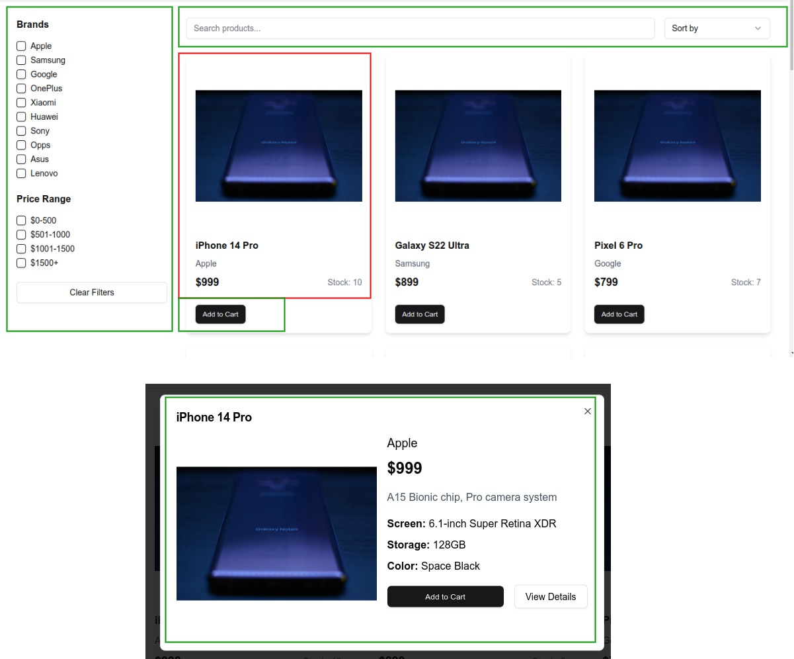

# Project Architecture

You can find the architecture of the project in here. Basically server side and client side rendered components have shown in here. We use red color to identify server side component and green color to identify client side component

## Navbar

## Footer

## Home

## Products

## Product details

## Checkout

## About

## Contact

## Terms

## Privacy

